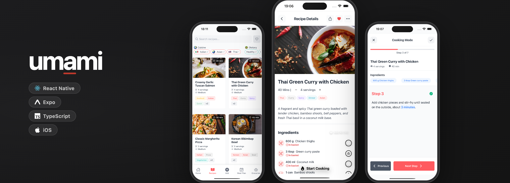

A mobile recipe management platform — React Native (Expo) with Supabase PostgreSQL, on-device ML Kit OCR, and DeepSeek AI for recipe extraction and nutrition analysis.

> **Backend API:** The REST API lives in a separate repository — [umami_backend-](https://github.com/archie-brown3/umami_backend-) (Node.js/Express, JWT auth, Joi validation, Docker).

## Architecture

```
+--------------------+       +---------------------------+       +------------------+
|  React Native App  | ----> |  Node.js/Express REST API | ----> |  Supabase (PG)   |
|  (Expo Router)     |       |  (separate repo)          |       |  Auth + Storage  |
+--------------------+       +---------------------------+       +------------------+
        |                                  |
        | camera OCR                      | AI prompts
        v                                  v
+--------------------+           +------------------+
|  On-device ML Kit  |           |  DeepSeek API    |
|  text recognition  |           |  recipe analysis |
+--------------------+           +------------------+
```

## Stack

| Layer | Technology |
|-------|-----------|
| Frontend | React Native 0.79, Expo SDK 53, TypeScript |
| Navigation | Expo Router (file-based, 21 routes) |
| State management | React Context (Auth, Recipe, MealPlan, Groceries, Subscription) |
| UI | Custom components (65+), shadcn/ui-inspired design system |
| Backend | [Separate repo](https://github.com/archie-brown3/umami_backend-) — Node.js, Express, JWT, Docker |
| Auth | Supabase Auth (JWT + Apple Sign In) |
| Database | Supabase (PostgreSQL) — 8 tables |
| AI | DeepSeek API (recipe extraction, nutrition analysis) |

## Project Structure

```
umami-dev/
├── app/                   Expo Router routes (21 screens)
│   ├── (auth)/            Login, register, forgot password
│   ├── (tabs)/            Home, recipes, add, meal plan, groceries
│   ├── recipe/            Recipe detail, create, edit
│   └── cooking/           Step-by-step cooking mode
├── src/
│   ├── components/        65+ React components
│   │   ├── recipes/       RecipeCard, RecipeList, IngredientInput, TagEditor
│   │   ├── groceries/     ShoppingListScreen, CupboardScreen, item cards
│   │   ├── meal-plan/     WeeklyCalendar, MealSlot, RecipePicker
│   │   ├── recipe/edit/   ImageEditSection, IngredientsCard, InstructionsCard
│   │   ├── ui/            Button, Card, Input, Badge, Toast, Avatar
│   │   └── ...
│   ├── services/          API clients, AI extractors, data migrations
│   ├── context/           React Context providers (5 domains)
│   ├── hooks/             Custom hooks (8)
│   ├── lib/               Supabase client, auth, RevenueCat
│   └── utils/             Image processing, validation, scaling
├── .github/workflows/     CI (lint + test)
└── assets/images/         App icons, header image
```

## Features

- Recipe CRUD with ingredient parsing and step-by-step instructions
- Meal planning with weekly calendar and drag-to-assign
- Shopping lists and cupboard/pantry inventory tracking
- Camera-based recipe capture (on-device ML Kit OCR)
- Instagram/web recipe extraction via URL
- AI-powered recipe analysis and nutrition breakdown (DeepSeek)
- Recipe scaling by servings
- Tag-based categorization and search
- Supabase authentication (email/password + Apple Sign In)
- RevenueCat subscription management
- Offline-aware with network status detection

## Backend API

The REST API that powers this app is maintained in [umami_backend-](https://github.com/archie-brown3/umami_backend-). It provides:

- JWT token verification against Supabase
- Full recipe CRUD with pagination, search, and tag filtering
- AI recipe extraction from text and URLs (DeepSeek)
- Request validation (Joi), rate limiting, CORS, Helmet security
- Docker multi-stage production build with health checks

See the [backend README](https://github.com/archie-brown3/umami_backend-) for the full API endpoint table, database schema, and quickstart.

## Database Schema

```
recipes
  id (uuid PK), user_id (FK auth.users), title, description, image_url,
  prep_time, cook_time, servings, difficulty, source_url, is_favorite, is_public

recipe_ingredients          ingredients
  recipe_id (FK recipes) ──>  id (uuid PK), name, category
  ingredient_id (FK)
  quantity, unit

recipe_steps                tags ──< recipe_tags >── recipes
  recipe_id (FK recipes)         id (uuid PK), name
  step_number, instruction

Supporting: meal_plans, meal_plan_recipes, shopping_lists, shopping_list_items
```

## Quickstart

```bash
npm install
cp .env.example .env   # add SUPABASE_URL, SUPABASE_ANON_KEY
npx expo start          # scan QR code with Expo Go
```

## Design Decisions

**Expo Router over React Navigation.** File-based routing maps directory structure to navigation, reducing boilerplate and making the screen hierarchy self-documenting.

**React Context over Redux.** With five bounded state domains (auth, recipes, meal plans, groceries, subscriptions), context providers with custom hooks are simpler and require less ceremony than a global store.

**Supabase over custom auth.** Managed auth (JWT, social login, row-level security) and PostgreSQL eliminates two infrastructure concerns while keeping the database relational.

**JWT passthrough.** The backend verifies Supabase-issued tokens rather than issuing its own — the API trusts the same auth provider the frontend uses, avoiding a separate auth system.

**AI as a service dependency.** Recipe extraction via DeepSeek is a call-out, not core logic. The service layer wraps it with caching and timeout handling so the app remains responsive if the AI endpoint is slow.

## Known Limitations

- No end-to-end test suite yet
- Recipe extraction from URLs relies on an external scraping service
- iOS build pipeline requires an Apple Developer account for TestFlight/App Store
- Real-time sync is polling-based via Supabase (no WebSocket support)
